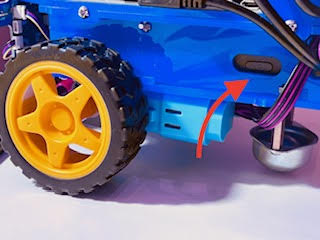
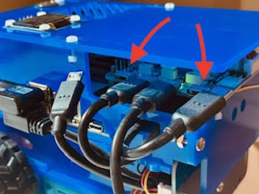
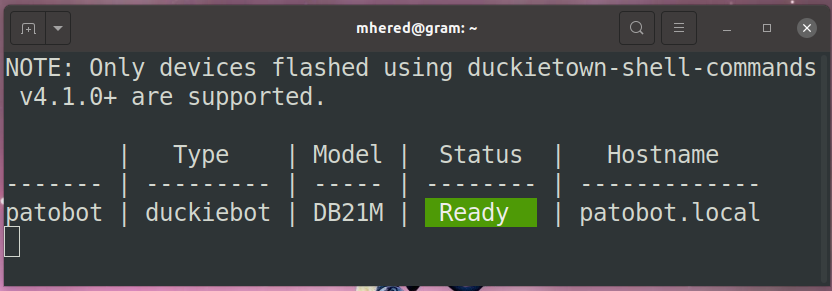

# Duckiebot
Two years after completing the [Self-Driving Cars with Duckietown MOOC on edx](https://www.edx.org/learn/technology/eth-zurich-self-driving-cars-with-duckietown) I decided to dust off my Duckiebot and go back to play with it to apply some of the things I learned in the last couple of years.

This repository contains the notes I collected to document this endeavor. 

## Which version?

It seems that the version I own is the [DB21M](https://docs.duckietown.com/daffy/opmanual-duckiebot/preliminaries_hardware/duckiebot_configurations/index.html#duckiebot-config-db21m).

## Power up

The first challenge was charging the battery - after two years of inactivity - in order to power up the bot.

I plugged the bot and tried to power it up - Note: using the side button in the battery, not the button at the top which is only to power down. 



The robot wouldn't boot. The LEDs lit up in odd colours, but the screen didn't work. After a while I noticed the fan in the Jetson would start to power up briefly and then power down again.

[Handling instructions in the docs](https://docs.duckietown.com/daffy/opmanual-duckiebot/operations/handling/db21.html#handling-duckiebot-db21) were not fully self-explanatory. After searching the docs and Slack, I came to the conclusion that the battery was totally drained and followed the advice in [the docs FAQ](https://docs.duckietown.com/daffy/opmanual-duckiebot/debugging_and_troubleshooting/faq/index.html) and in [Slack](https://stackoverflowteams.com/c/duckietown/a/230/1434) to unplug the HUT cables going to motors and Jetson, and letting only the cables needed to charge the battery for 5+ hours.



After about 30' charging in this way, I plugged the cables and tried again to power up. This time the fan started, the wifi dongle started to blink blue... and then it shut off - before the screen ever switching on. Well, it seems I am moving in the right direction, but we need the battery to charge longer.

Note: browsing the [section on circuits and batteries](https://docs.duckietown.com/daffy/opmanual-duckiebot/preliminaries_hardware/circuits_batteries/index.html) of the docs I came across the description of the so-called *battery protection mode* by which a depleted battery may go into hibernation and remain unresponsive during about 30' while trickle charging to a safe level.

Note: USB cables from left to right 

1. to Jetson
2. to battery
3. to mains
4. to motors and LEDs

Unplug 3 from the mains when the battery is charged then connect cables in this order: 2 - 4 -1 (cfr steps 65-67 of the [assembly instructions](https://docs.duckietown.com/daffy/opmanual-duckiebot/assembly/db21m/index.html#howto-power-db21m))

After the whole night charging, I tried again but the booting process did not complete. There was no blinking of the wifi dongle and when I plugged in a screen to see what was going on the screen froze with a Nvidia logo.

I assumed at some point the SD card got corrupted - perhaps when it attempted to boot and run out of battery or one of the times when I forcefully unplugged the Jetson...

## Software

I decided to install software in the laptop and flash the SD again following [the docs](https://docs.duckietown.com/daffy/opmanual-duckiebot/setup/setup_laptop/index.html) step by step.

Note: I am using Ubuntu 20.04 instead of the recommended 22.04.

### Install dependencies 

```bash
$ sudo apt update
$ sudo upgrade
$ sudo apt install -y python3-pip git git-lfs curl wget
$ pip3 version
pip 20.0.2 from /usr/lib/python3/dist-packages/pip (python 3.8)
```

### Install Docker

Remove any older versions of Docker (there were none)

```bash
$ sudo apt-get remove docker docker-engine docker.io containerd runc
```

Set up the apt repo containing Docker

```bash
$ sudo apt-get update
$ sudo apt-get install ca-certificates curl gnupg
```

Add the official GPG key

```bash
$ sudo mkdir -m 0755 -p /etc/apt/keyrings
$ curl -fsSL https://download.docker.com/linux/ubuntu/gpg | sudo gpg --dearmor -o /etc/apt/keyrings/docker.gpg
```

Set up the repository

```bash
$ echo \
  "deb [arch="$(dpkg --print-architecture)" signed-by=/etc/apt/keyrings/docker.gpg] https://download.docker.com/linux/ubuntu \
  "$(. /etc/os-release && echo "$VERSION_CODENAME")" stable" | \
  sudo tee /etc/apt/sources.list.d/docker.list > /dev/null
```

Update again and install Docker Engine and Docker Compose:

```bash
$ sudo apt-get update
$ sudo apt-get install docker-ce docker-ce-cli containerd.io docker-buildx-plugin docker-compose-plugin
$ sudo apt-get install docker-compose
```

Add the current user to the `docker` user group

```bash
$ sudo adduser `whoami` docker
```

Note: I had to **restart** for this change to take effect

Checkpoint (should be docker version > v1.4.0 and `buildx` version > v.0.8.0):

```bash
$ docker --version
Docker version 24.0.6, build ed223bc
$ docker buildx version
github.com/docker/buildx v0.11.2 9872040
```

Test docker:

```bash
$ docker run hello-world

Hello from Docker!
...
```

### Install Duckietown shell

```bash
$ pip3 install --no-cache-dir --user --upgrade duckietown-shell
```

Do `$ nano ~/.bashrc` to add the following lines to the end of `~/.bashrc` in order to make local binaries accessible to the system:

```
...
# make Duckietown shell local binaries accesible
export PATH=~/.local/bin:${PATH}
```

Save the file and source it by closing and reopening the terminal or running `$ source ~/.bashrc` to apply the change.

Check it works: 

``````bash
$ which dts
/home/mhered/.local/bin/dts
``````

Set version to `daffy` :

```bash
$ dts --set-version daffy
Duckietown Shell (v5.5.10)
INFO:dts:Configured dts to version: daffy
...
```

Log in to [Duckietown](https://hub.duckietown.com/profile/) with the Github user, copy the Duckietown token and pass it to `dts` with:

```bash
$ dts tok set
...
Enter token: ****************

dts :  Correctly identified as uid = ****

```

Checkpoint:

```bash
$ dts version
Duckietown Shell (v5.5.10)
INFO:dts:Commands version: daffy
INFO:dts:Checking for updates in the Duckietown shell commands repo...
INFO:dts:Duckietown shell commands are up-to-date.
...
```

```bash
$ dts tok status
...
dts :  Correctly identified as uid = 3372
```

### Configure DockerHub

Login to [DockerHub](https://hub.docker.com/)  (login:mhered/pwd: >9 letters)

Create an Access Token : username -> Account Settings -> Security -> New Access Token

Test the token from the docker CLI:

```bash
$ docker login -u mhered
Password: 
...
Login Succeeded
```

Provide the docker credentials (login and token) to `dts`: 

```bash
$ dts config docker credentials set \
    --username mhered \
    --password ****************    
...
INFO:dts:Docker access credentials stored!
```

Checkpoint:

```bash
$ dts config docker credentials info
...
INFO:dts:Docker credentials:

	registry:   docker.io
	username:   mhered
	  secret:   ****************
```

Note: Duckietown and DockerHub credentials are stored unencrypted in `~/.dt-shell/config.yaml`

Note: repeat this process if a new access token needs to be generated. 

### Flash SD card

Tried and failed to read or format the SD (both in Ubuntu and Windows) until I came to the conclusion if was fried and bought a new one.

The GUI failed to launch with a page not found error (why?):

```bash
$ dts init_sd_card --gui
...
 File "/home/mhered/.local/lib/python3.8/site-packages/dockertown/utils.py", line 220, in run
    :      raise DockerException(
    :  dockertown.exceptions.DockerException: The docker command executed was `/usr/bin/docker exec c8ce09d93cf92fa64615eac9417fe079329dfe30de65c8eebfbe511c41581864 sleep infinity`.
    :  It returned with code 1
    :  The content of stdout is ''
    :  The content of stderr is 'Error response from daemon: Container c8ce09d93cf92fa64615eac9417fe079329dfe30de65c8eebfbe511c41581864 is not running
    :  '
WARNING:dts:Please update "pip" to have better debug info.

dts :  To report a bug, please also include the contents of /home/mhered/shell-debug-info.txt
```

So I used the CLI:

```bash
$ dts init_sd_card --hostname patobot --type duckiebot --configuration DB21M --wifi MY_WIFI:MY_PWD --country ES
```

The CLI will ask to accept 3rd party licenses, request the SD size (32) and ask to select the device to be flashed (in my case `/dev/sda/` WARNING!! Be careful you could wipe your hard drive).

Then there are 3 long steps: download took 2-3h, then flash 30' and verify.

Default username and password in case you need to log in manually:  `duckie` / `quackquack`

### Update 25/09/23

I flashed a new SD card and put it in the duckiebot, and finally managed to get it to boot: wifi dongle flashing, LEDs go white and the bot screen powers up. Battery was showing at 0% in the screen so I plugged it in.

The bot was not detected by dts:

```bash
$ dts fleet discover

NOTE: Only devices flashed using duckietown-shell-commands v4.1.0+ are supported.

 | Type | Model |  Status  | Hostname
 | ---- | ----- | -------- | --------

```

First I realized that the network configuration was incorrect, which I fixed plugging the SD in the laptop, opening a terminal in folder `/etc/`  (inside the SD) and manually editing the config file `$ sudo nano wpa_supplicant.conf`, see [here](https://docs.duckietown.com/daffy/opmanual-duckiebot/debugging_and_troubleshooting/network_config/index.html#duckiebot-network)

Still didn't work so I plugged a screen to the bot and noticed many messages similar to `tegra-i2c 7000c700.i2c no acknowledge from address 0x50`. One potential explanation is apparently that [there are peripherals incorrectly powered](https://forums.developer.nvidia.com/t/tegra-i2c-7000c400-i2c-no-acknowledge-from-address-0x3c/196035/3). This together with the 0% battery indication made me decide to leave the bot charging overnight (to be honest I doubt the battery would be healthy and I have actually cycled it a few times since the last charge). Note [Duckietown Stack Overflow](https://stackoverflowteams.com/c/duckietown/questions) offers many other explanations to these messages (including unplugged cables, a faulty Jetson, etc.)

While at it, this is apparently [the proper sequence to power up](https://stackoverflowteams.com/c/duckietown/questions/208):

1. Get to a stable starting state: cable to both the first and last  ports of the HUT are pulled out, battery has been charging for more than an hour, known good SD card has been inserted into the nano
2. Unplug the charger cable from the charger and/or the HUT
3. Plug in the cable to the first and last ports of the HUT
4. Depress the button on the battery once
5. Wait till the wifi dongle is blinking and depress the dashboard button on top of the robot once

After all the night charging battery shows 24%. Boot works but does not connect. Wifi dongle blinking in cycles of 11 blinks(?) then pause. 

Next steps to troubleshoot connection:

- [x] connect with Ethernet cable directly to router then ssh
- [ ] Connect directly to the bot via keyboard

### Connection via Ethernet

I connected via ethernet and now I am able to ssh into the bot:

```bash
$ ssh duckie@patobot.local
duckie@patobot.local's password: 
Welcome to Ubuntu 18.04.5 LTS (GNU/Linux 4.9.140-tegra aarch64)
...
```

And `$ dts fleet discover` works:



Even the dashboard worked (at least briefly) and allowed me see the camera feed and to login with the token following [the documentation](https://docs.duckietown.com/daffy/opmanual-duckiebot/setup/setup_dashboard/index.html)

I concluded it was a Wifi configuration issue. Upon inspection of `/etc/wpa_supplicant.conf` bam! I had a typo in the SSID.

I restarted and it works: ssh and fleet discover work over Wifi.

The remaining question is why Dashboard stopped working...

I think it may be related to me  clicking somewhere in the dashboard to upgrade compose...

Troubleshooting ideas: 

- [x] Try to connect directly to the IP address is http://192.168.8.116 > did not work but  http://192.168.8.116:9000/#/home takes me to portainer ?!

- [ ] I realised I missed the duckiebot software update step in https://docs.duckietown.com/daffy/opmanual-duckiebot/debugging_and_troubleshooting/update/index.html#duckiebot-autoupdate

This could explain that: 

* fleet discover does NOT show the dashboard status
* Stack Overflow refers to there is some mDNS topics, see https://feeding.cloud.geek.nz/posts/upgrading-from-ubuntu-bionic-to-focal/ but seem old

I was so smart as to start the `$ dts duckiebot update patobot` with 0% battery - battery does not seem to charge above 24% and it drains fast - and of course the bot died on me halfway the software update. Let's hope I didn't make matters worse.

An update sequence / troubleshoot checklist from [my own question years ago](https://stackoverflowteams.com/c/duckietown/questions/1835):

* [ ] dts software is updated to the latest version by running:
  * [x] `$ dts update`
  * [x] `$ dts desktop update`
  * [x] `$ dts duckiebot update patobot` (needs robot)

- [x] Robot is reachable via `$ ping patobot.local`
- [x] Robot is reachable via `$ ssh duckie@patobot.local`
- [x] Robot is visible through `$ dts fleet discover`
  - [ ] ...and Dashboard is UP
- [x] The dashboard is operational in http://patobot.local :
  - [ ] I can see signal from camera, motors, and all health stats
  - [ ] portainer shows X containers, Y healthy and Z running

- [ ] The robot is operational:

  - I can move the robot with `$ dts duckiebot keyboard_control patobot` [[+](https://docs.duckietown.com/daffy/opmanual-duckiebot/operations/make_it_move/index.html)]

  - I can stream camera with `$ dts start_gui_tools patobot`and then from inside docker: `[DOCKER]$ rqt_image_view` [[+](https://docs.duckietown.com/daffy/opmanual-duckiebot/operations/make_it_see/index.html)]

To be continued...


